## Chapter 1

### Suggested Exercise:
1. **Consider the combinations problem:**
    - Given given integers **n > 0** and **k ≥ 0**, with **n >= k**, list all the ways to choose k things  out of n (*use n distinct symbols*). 
    - Assume that order doesn’t matter, in the sense that ab and ba are considered the same, so it’s easiest to use words that have the letters in alphabetical order, like abc instead of acb or any of the other permutations of those three symbols.
    - For Example
        - With **n = 4** and **k = 2**, the desired list is `ab, ac, ad, bc, bd, cd`
    - Design nodes and decisions to build a tree of possiblities for the intances with **n = 5** and **k= 3**.

### Exercise 1 [10 points] - (Traveling Salesperson problem by Brute Force):
1. Suppose we have a directed graph (like below) with *n* vertices labeled 1 through *n*, implemented using an *n* matric where row *j*, column *k* contains the weight of the edge going from vertex *j* to vertex *k*, or a dash if there is no edge from *j* to *k*.
    - The traveling Salesperson Problem (TSP) is as follows:
        - given a weight matrix as input, determine the cycle - a path that starts at vertex 1, hits all the vertices exactly once, and ends up back at vertex 1 - that has smallest total weight of its edge. Note that the minimum weight cycle might be infinity.
    - Figure out how to use the brute force technique to solve an instance of this problem, and demonstrate your algorithm on the matrix below. be sure to think about pruning, and what information should be kept in each node.
    - Submit your work (just show me the possibilities tree for the instance, along with statement of the answer, which is the best cycle) through Canvas.
    - Directed Graph:

        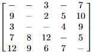

        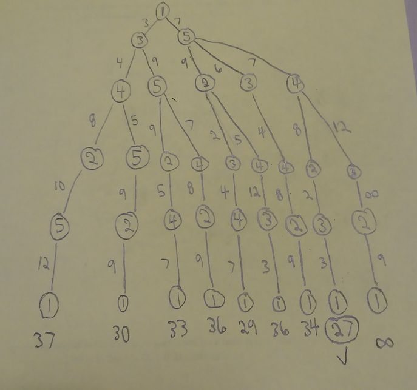

    - Best Cycle:
        - {1, 5, 4, 2, 3, 1} = (7 + 7 + 8 + 2 + 3) = ***27***


### Exercise 2 [4 points] - (Sums to n Problem by Brute Force):
1. Consider the "sums to *n* problem:"
    - Given a **positive** integer *n*, list all the different ways to get a collection of positive integers adding up to *n*. Assume that we don't care about order, so 1 + 2 and 2 + 1 are the same possibility.
    - For *n* = 3, the possibilites are:
        - 1 + 1 + 1
        - 1 + 2
        - 3
    - Your job on this porject is to create a Java class that will take *n* as input and produce a list of all the possiblities (with each item in the list on its own row, with the integers in it in nondecreasing orer left to right).
    - Name the class **SumsToN**. Submite your work through Canvas - I need the source code for all the classes in oyur application (probably just one).
    - Note that I want to be able to take the source files(s) you send me, put them in a folder, go into that folder and at the command line type `javac SumsToN.java` and then type `java SumsToN` and have your application ask, at the command prompt, for the value of *n* and then print out the list of possibilities - one per line - in the command window.

```java
import java.util.ArrayList;
import java.util.Scanner;

public class SumsToN
{
    public static void main(String[] args)
    {
        Scanner stdIn = new Scanner(System.in);
        int n;
        int end;
        do
        {
            System.out.print("\nWelcome to Program #1\n\nPlease enter an Integer for 'n' (must be positive): ");
            while (!stdIn.hasNextInt()){
                System.out.print("\nPlease enter an Integer: ");
                stdIn.next();
            }
            n = stdIn.nextInt();
            for(int i = 1; n < i;)
            {
                System.out.print("\nPlease enter a positive Integer: ");
                while (!stdIn.hasNextInt()){
                    System.out.print("\nPlease enter an Integer: ");
                    stdIn.next();
                }
                n = stdIn.nextInt();
            }
            findSum(n);
            System.out.print("\n\nEnter '0' to quit || '1' Try again: ");
            while (!stdIn.hasNextDouble())
            {
                System.out.println("That's not a number!");
                stdIn.next();
            }
            end = stdIn.nextInt();
        } while (end != 0);

    } // end main method


    private static void findSum(int n)
    {
        findSums(n, new ArrayList<>());
        System.out.print(Integer.toString(n));
    } // end findSum method


    private static void findSums(int n, ArrayList<Integer> addEnds)
    {
        ArrayList<Integer> addEndArgs;
        int last = 0;
        if (n > 1)
        {
            for (int i = 1; i <= n / 2; i++)
            {
                addEndArgs = new ArrayList<>(addEnds);
                int j = n - i;
                if (!addEnds.isEmpty())
                {
                    last = addEnds.get(addEnds.size() - 1);
                }
                if (i >= last && j >= i)
                {
                    addEndArgs.add(i);
                    findSums(j, addEndArgs);
                    for (Integer addend : addEnds)
                    {
                        System.out.print(Integer.toString(addend) + "+");
                    }
                    System.out.println(Integer.toString(i) + "+"
                            + Integer.toString(j));

                }
            }
        }
    } // end findSums method
} // end class SumsToN
```

## Chapter 2
### Exercise 3 [10 points]
1. This project is intended to give you some simple, concrete experience with the formal definitions of *o* and *O*.
    - Let ***f(n) = n^{3}***. 
    - For each of the functions *g* given below, formally prove, directly from the definition, that ***f ∈ \theta(g)***
    - Each of your 6 separate proofs must clearly state *N* and *c* as in the definition of *O()* and must clearly show the algebra proving your inequalities.
    - Make sure that you have some reason for choosing *N* and *c*, rather than just guessing and bluffing that the corresponding inequality is true (I'll be more skeptical of your inequalities if you haven't picked *N* and *c* sensibly).
        - a. g(n) = 1000n^{3}
        - b. g(n) = n^{3} + 1000n^{2}
        - c. g(n) = n^{3} - 1000n^{2} (assume n >= 1000 for this to be a legitimate function for our purposes)
        
   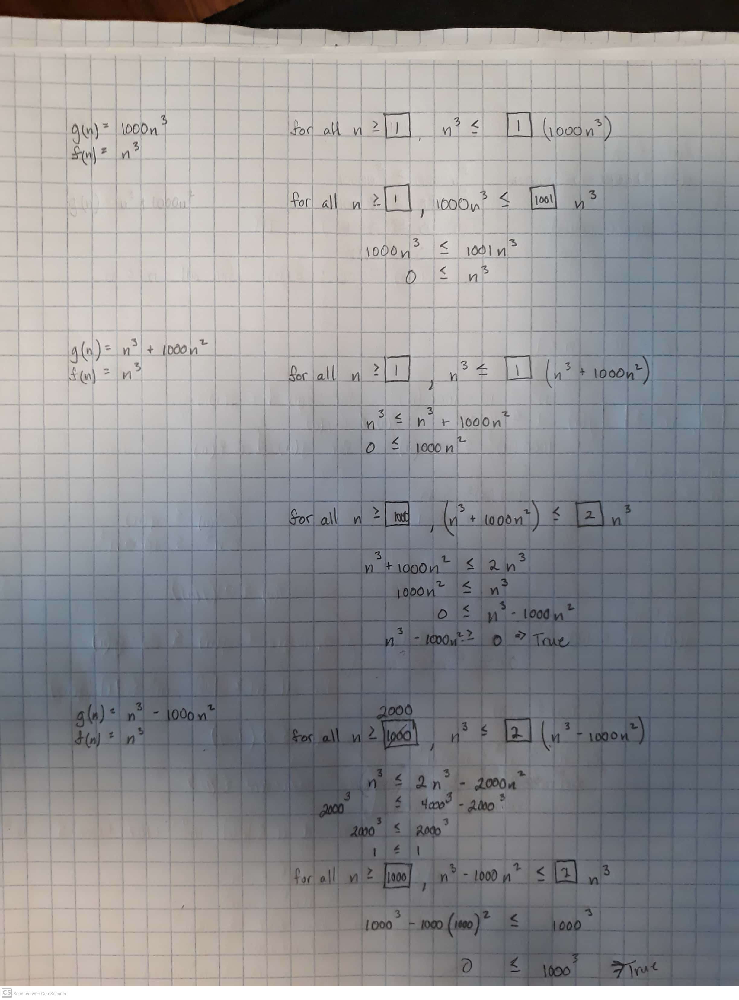

### Exercise 4 [4 points]
1. Your job on this Exercise is to consider the functions ***f(n) = n^{3} 2^{n}*** and ***g(n) = n^{2}3^{n}*** and compare their efficiency categories.
    - Try to prove ***f ∈ O(g)*** and ***g ∈ O(f)***. Decide which of these is true, and whether both are true, and fairly formal proofs of whatever you determine.
    - if you prove both of these (meaning f and g are in the same O category), you will be done. Otherwise, use a limit argument to prove that one of them is not in big-O of the other.
    - you might want to start by experimenting - computing some values of the these functions to arrive at a conjecture as to how their growth rates compare.
    
   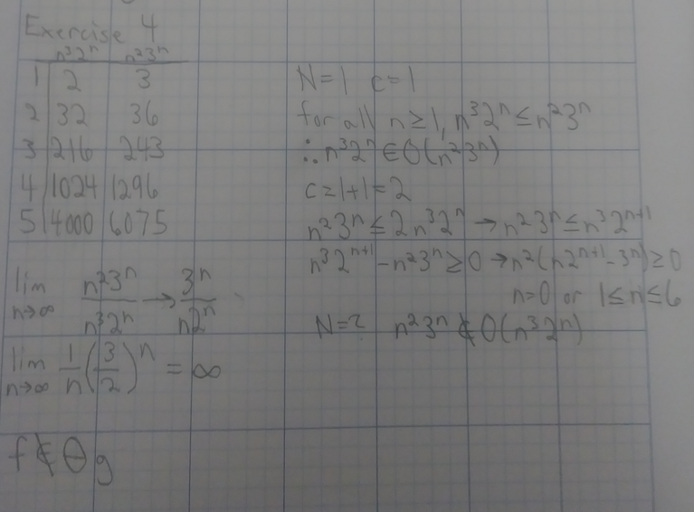

## Chapter 3
### Exercise 5 [10 points]
1. Figure out the Θ efficiency category (be sure to do it in terms ofn) for the recurrence relation (for the number of multiplications performed in Strassen’s algorithm, to be coveredin the next chapter).

      **T(n) = 7T(n/2)**

   - Be sure to write out all the steps carefully, essentially repeating the derivation of the Master Theorem.
   - Assume that **n = 2^{m}**
   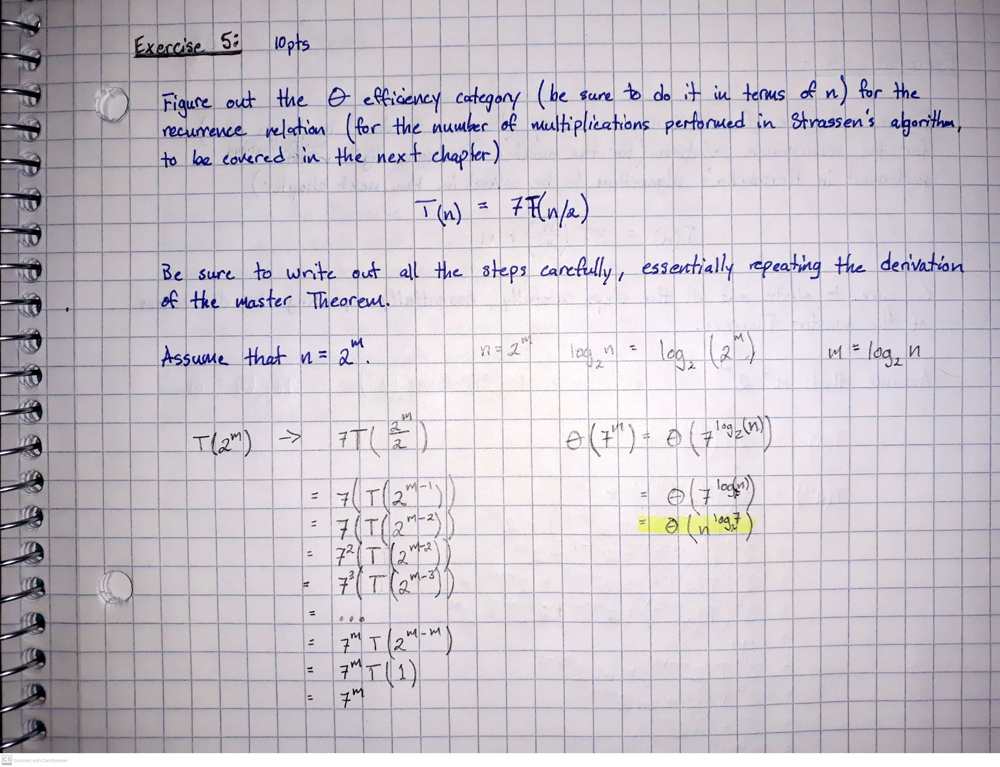

### Exercise 6 [4 points]
1. Figure out the Θ efficiency category (be sure to do it in terms ofn) for the recurrence relation (for the number of single digit multiplications performed in Karasuba’s algorithm,to be covered in the next chapter)

      **T(n) = 3T(n/2) + n**

   - Be sure to write out all the steps carefully, essentially repeating the derivation of the Master Theorem.
   - Assume that **n = 2^{m}**
   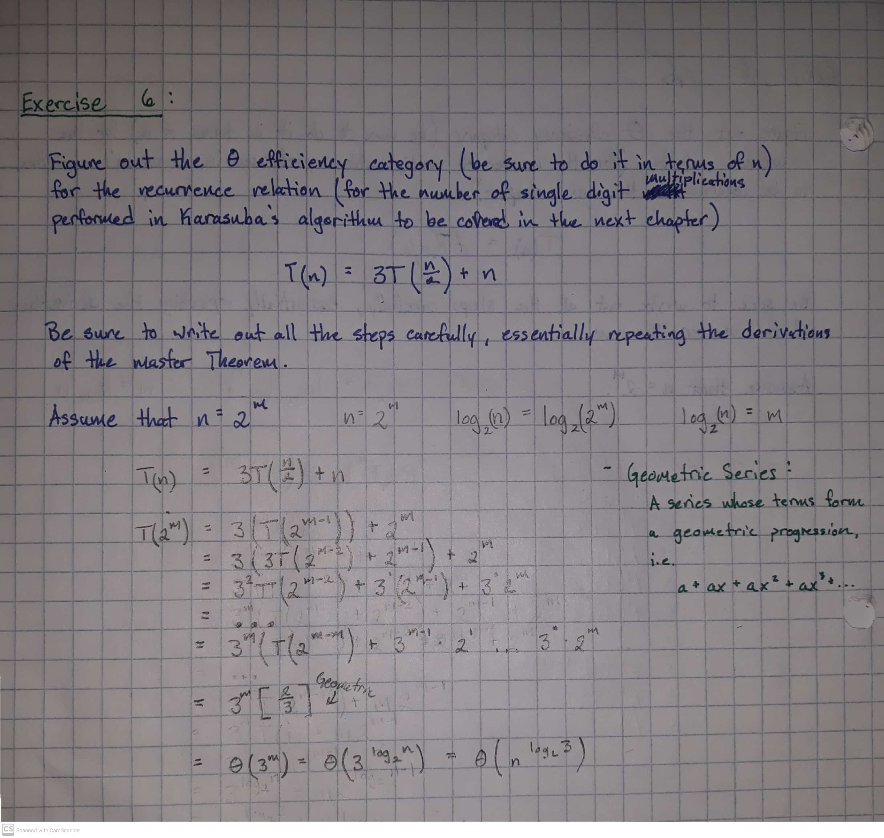
   
### Exercise 7 [4 points]
1. Suppose you have a function defined by:

     **T(n) = log_2(1) + log_2(2) + ... + log_2(n)**
      
   - Your job on this Exerise is to apply the previous discussion to find a well-known functiom ***g(n)*** such that ***T(n) ∈ Θ(g(n))*** and prove it, of course, by bounding ***T(n)*** above and below by functions that you can integrate, both of which are in ***Θ(g(n))***.
   - To receive credit for this Exercise, you must draw sketches showing exactly what functions you are using to bound ***T*** by, both above and below, and work out the ***Θ*** categories for the two integrals, which need to be the same to give the ***Θ*** category for ***T***.
    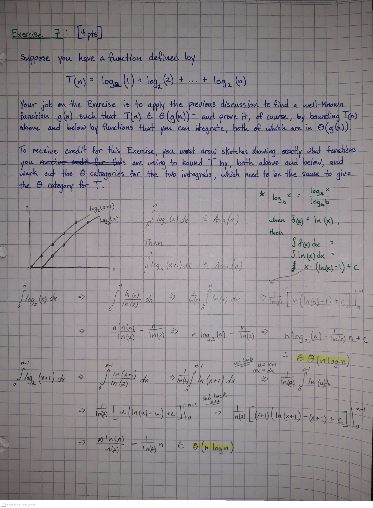

## Chapter 4
### Exercise 8
   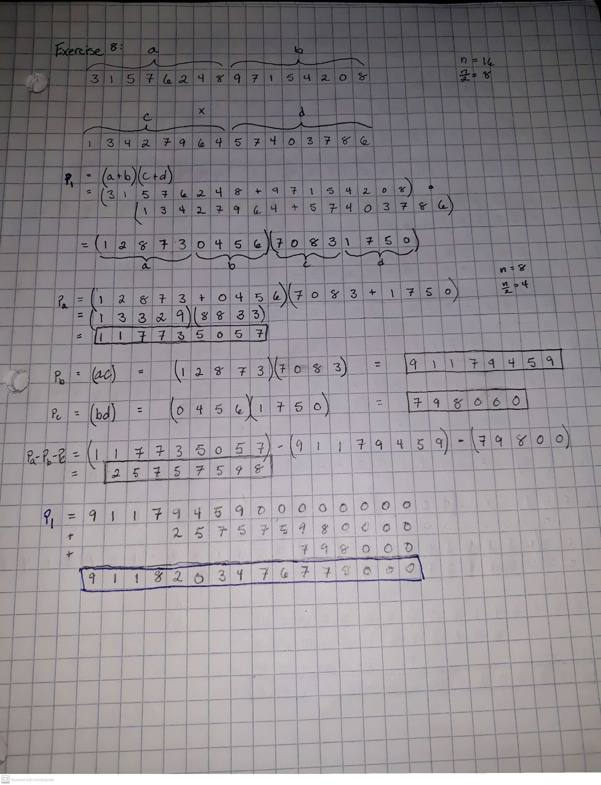
   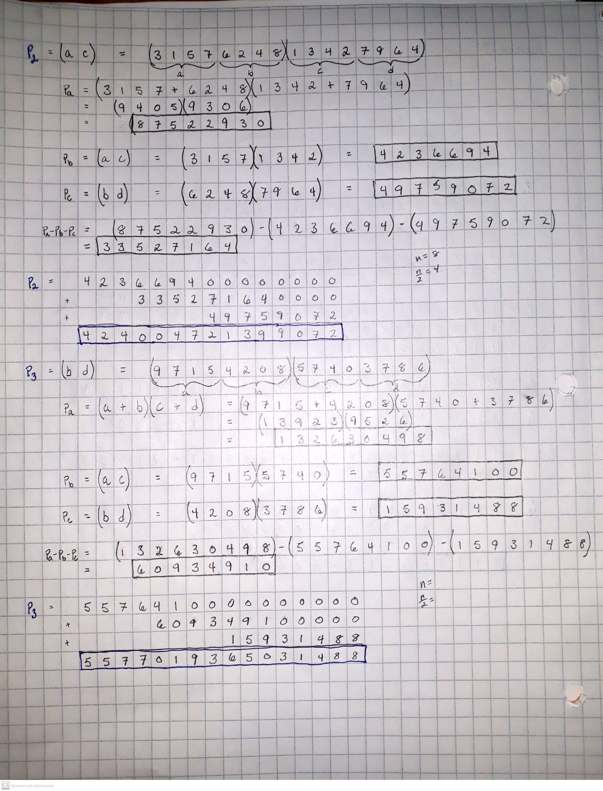
   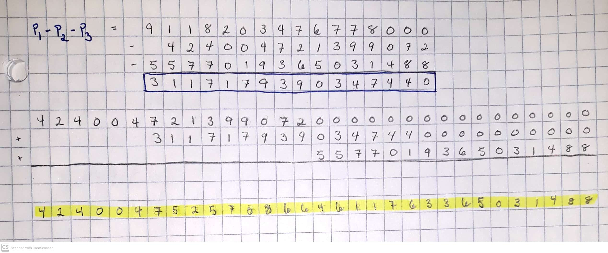

### Exercise 9
   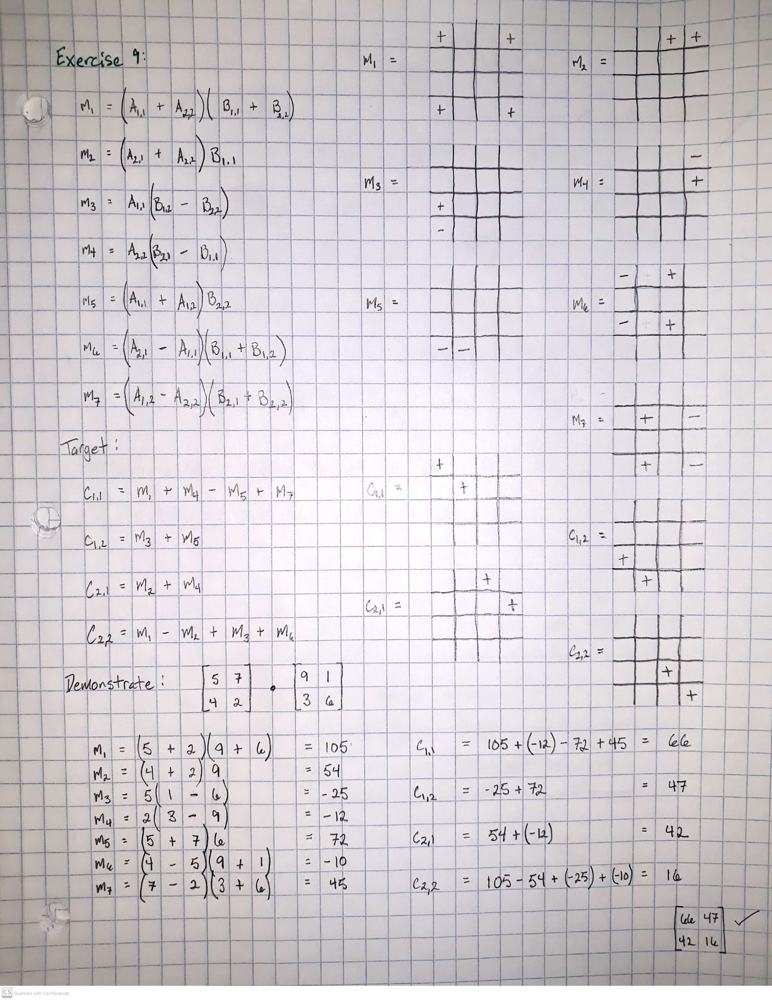

### Exercise 10
   
