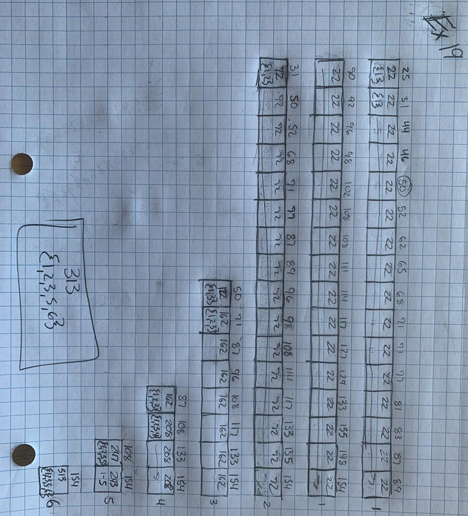
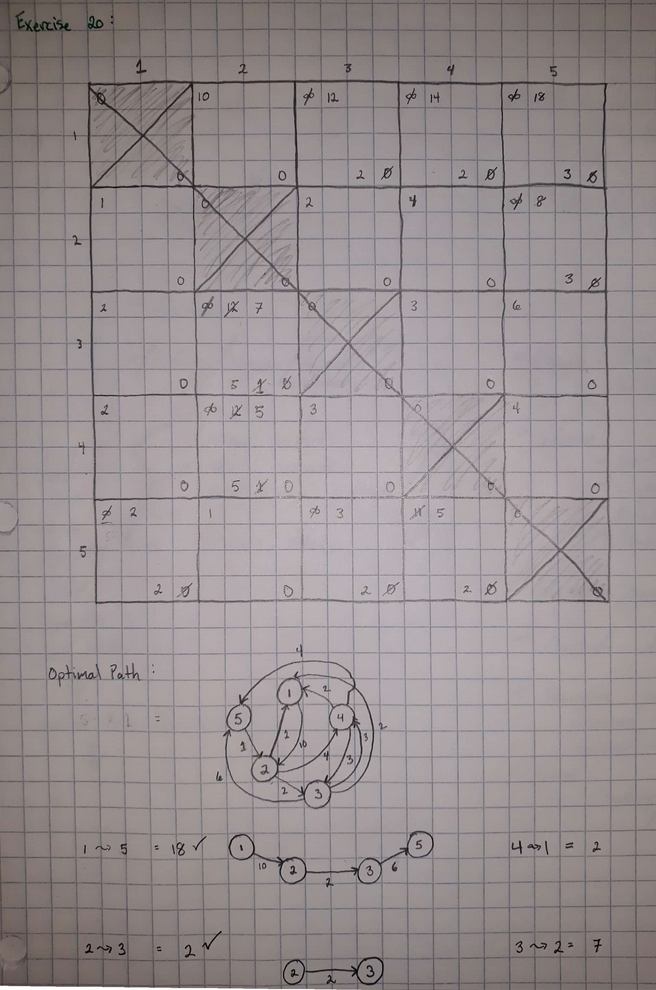
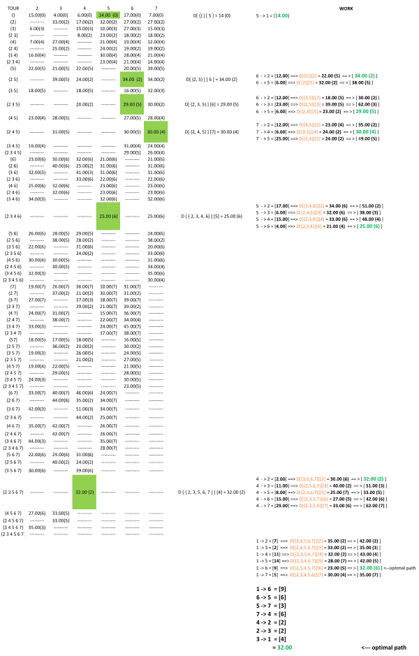
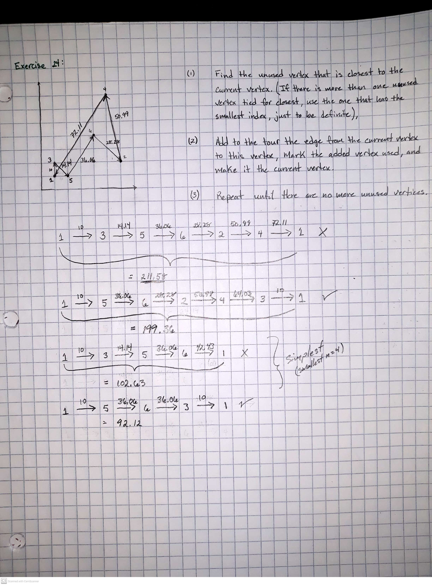

## Chapter 7: Elliptic Curve Cryptography
### Exercise 16


### Excerise 17

```
77066213 >> 71777070
by repeated addings, 10509P= (2906,24392)
by scalar mult           (2906,24392)
Message = "flee"
```

### Exercise 18
- Skipped this question 

## Chapter 8: Dynamic Programming
### Exercise 19


### Exercise 20


### Exercise 21

```java
import java.util.ArrayList;
import java.util.Arrays;
import java.util.List;
import java.util.Scanner;

public class ex21 {

    public static int solve(int[] A) {
        int[][] MV = new int[A.length][A.length];
        String[][] table = initTable(A.length);


        for (int interval = 0; interval < A.length; interval++) {
            for (int i = 0, j = interval; j < A.length; i++, j++) {
                int a, b, c;
                if (i + 2 <= j) {
                    a = MV[i + 2][j];
                } else {
                    a = 0;
                }
                //////////////////////////////////
                if (i + 1 <= j - 1) {
                    b = MV[i + 1][j - 1];

                } else {
                    b = 0;
                }
                //////////////////////////////////
                if (i <= j - 2) {
                    c = MV[i][j - 2];
                } else {
                    c = 0;
                }
                //////////////////////////////////
                MV[i][j] = Math
                        .max(A[i] + Math.min(a, b), A[j] + Math.min(b, c));
                int F = A[i] + Math.min(a, b);
                int L = A[j] + Math.min(b, c);

                if (F > L) {
                    table[i][j] = MV[i][j] + " (F)";
                } else if (F == L) {
                    table[i][j] = MV[i][j] + " (*)";
                } else {
                    table[i][j] = MV[i][j] + " (L)";
                }
            }

        }
        printTable(table);
        return MV[0][A.length - 1];
    }

    private static String[][] initTable(int size) {
        String[][] table = new String[size][size];
        for (int i = 0; i < size; i++) {
            for (int j = 0; j < size; j++) {
                table[i][j] = "0 (-)";
            }
        }
        return table;
    }

    private static void printTable(String[][] table) {
        for (int i = 0; i < table.length; i++) {
            if (i == 0) {
                System.out.printf("%5s", "");
                for (int k = 0; k < table.length; k++) {
                    System.out.printf("%10d ", (k + 1));
                }
                System.out.println();
            }
            System.out.printf("%5d %s", (i + 1), "|");
            for (int j = 0; j < table.length; j++) {
                System.out.printf("%11s", table[i][j]);
            }
            System.out.println("\n");
        }
    }

    private static int[] getUserInput() {
        List<Integer> numbers = new ArrayList<>();
        Scanner scanner = new Scanner(System.in);
        System.out.println("Enter some integers, separated by a space or comma, press enter twice to continue.");
        String[] next = scanner.nextLine().split("[\\s,]");
        int[] numArray = new int[next.length];
        for (int i = 0; i < next.length; i++) {
            numArray[i] = Integer.parseInt(next[i]);
        }
        return numArray;
    }

    public static void main(String[] args) {
        int[] A = getUserInput();
        System.out.println(Arrays.toString(A) + "\n");
        int[] B = {3, 1, 7, 5, 8, 4, 6, 5, 4, 2};
        System.out.println("Max value to be selected by player 1 = [ " + solve(A) + " ]");
    }
}

```

## Chapter 8: Dynamic Programming (Cont'd)
### Exercise 22


### Exercise 23

## Chapter 9: The Greedy Approach
### Exercise 24


## Chapter 10: Transform and Conquer
### Exercise 25


