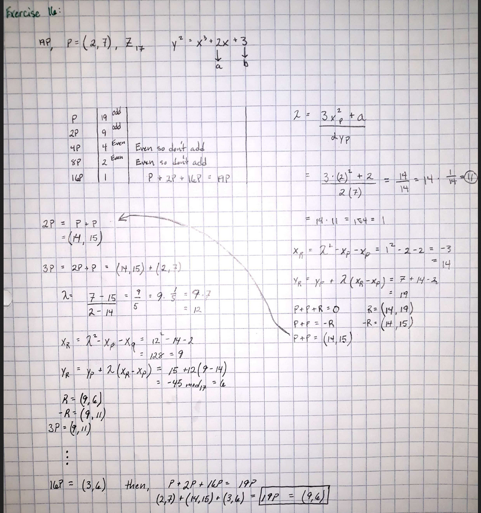

## Chapter 7: Elliptic Curve Cryptography
### Exercise 16


### Excerise 17

```
77066213 >> 71777070
by repeated addings, 10509P= (2906,24392)
by scalar mult           (2906,24392)
Message = "flee"
```

### Exercise 18
- Skipped this question 

## Chapter 8: Dynamic Programming
### Exercise 19


### Exercise 20


### Exercise 21

```java
import java.util.ArrayList;
import java.util.Arrays;
import java.util.List;
import java.util.Scanner;

public class ex21 {

    public static int solve(int[] A) {
        int[][] MV = new int[A.length][A.length];
        String[][] table = initTable(A.length);


        for (int interval = 0; interval < A.length; interval++) {
            for (int i = 0, j = interval; j < A.length; i++, j++) {
                int a, b, c;
                if (i + 2 <= j) {
                    a = MV[i + 2][j];
                } else {
                    a = 0;
                }
                //////////////////////////////////
                if (i + 1 <= j - 1) {
                    b = MV[i + 1][j - 1];

                } else {
                    b = 0;
                }
                //////////////////////////////////
                if (i <= j - 2) {
                    c = MV[i][j - 2];
                } else {
                    c = 0;
                }
                //////////////////////////////////
                MV[i][j] = Math
                        .max(A[i] + Math.min(a, b), A[j] + Math.min(b, c));
                int F = A[i] + Math.min(a, b);
                int L = A[j] + Math.min(b, c);

                if (F > L) {
                    table[i][j] = MV[i][j] + " (F)";
                } else if (F == L) {
                    table[i][j] = MV[i][j] + " (*)";
                } else {
                    table[i][j] = MV[i][j] + " (L)";
                }
            }

        }
        printTable(table);
        return MV[0][A.length - 1];
    }

    private static String[][] initTable(int size) {
        String[][] table = new String[size][size];
        for (int i = 0; i < size; i++) {
            for (int j = 0; j < size; j++) {
                table[i][j] = "0 (-)";
            }
        }
        return table;
    }

    private static void printTable(String[][] table) {
        for (int i = 0; i < table.length; i++) {
            if (i == 0) {
                System.out.printf("%5s", "");
                for (int k = 0; k < table.length; k++) {
                    System.out.printf("%10d ", (k + 1));
                }
                System.out.println();
            }
            System.out.printf("%5d %s", (i + 1), "|");
            for (int j = 0; j < table.length; j++) {
                System.out.printf("%11s", table[i][j]);
            }
            System.out.println("\n");
        }
    }

    private static int[] getUserInput() {
        List<Integer> numbers = new ArrayList<>();
        Scanner scanner = new Scanner(System.in);
        System.out.println("Enter some integers, separated by a space or comma, press enter twice to continue.");
        String[] next = scanner.nextLine().split("[\\s,]");
        int[] numArray = new int[next.length];
        for (int i = 0; i < next.length; i++) {
            numArray[i] = Integer.parseInt(next[i]);
        }
        return numArray;
    }

    public static void main(String[] args) {
        int[] A = getUserInput();
        System.out.println(Arrays.toString(A) + "\n");
        int[] B = {3, 1, 7, 5, 8, 4, 6, 5, 4, 2};
        System.out.println("Max value to be selected by player 1 = [ " + solve(A) + " ]");
    }
}

```

## Chapter 8: Dynamic Programming (Cont'd)
### Exercise 22


### Exercise 23


```java
import java.util.*;

public class Ex23{
    
    private static final int RIGHT = 0;
    private static final int DOWN = 1;
    private static final int DIAG = 2;

    private static OptMove[][] graph;
    private static char[] seq1;
    private static char[] seq2;

    public static void main(String[] args) {
        Scanner keys = new Scanner(System.in);
        print("Enter first sequence (all caps, no spaces): ");
        seq1 = (keys.nextLine()+"-").toCharArray();

        print("Enter second sequence (all caps, no spaces): ");
        seq2 = (keys.nextLine()+"-").toCharArray();

        graph = new OptMove[seq1.length][seq2.length];

        //fill graph base cases
        for(int i = 0; i < seq1.length; i++){
           graph[seq1.length - i - 1][seq2.length - 1] = new OptMove(i * 2, RIGHT);
        }
        for(int i = 0; i < seq2.length; i++){
            graph[seq1.length - 1][seq2.length - i - 1] = new OptMove(i * 2, DOWN);
        }


        for(int i = 0; i < seq2.length - 1; i++){
            for(int j = 0; j < seq1.length - 1; j++){
                fillGraph(seq1.length - 2 - j, seq2.length - 2 - i);
            }
        }

        printGraph();

        printOptScore();
    }
    /*
    algortihm rule:
    score in cell [i][j] will be min score of one of 3 moves:
    right move [i + 1][j] score + 2
    down move [i][j+1] score + 2
    or diagonal move [i+1][j+1] score + (0 if seq1[i] == seq2[j] or 1 otherwise)
    */

    private static void fillGraph(int i, int j){

        int rmove, dmove, bmove;

        //scores of each move
        rmove = graph[i+1][j].score + 2;
        dmove = graph[i][j+1].score + 2;
        bmove = graph[i+1][j+1].score + (seq1[i] == seq2[j] ? 0 : 1);

        //find min and set the score and opt move
        if(rmove < bmove && rmove < dmove){
            graph[i][j] = new OptMove(rmove, RIGHT);
        }
        else if(dmove < bmove && dmove <= rmove){
            graph[i][j] = new OptMove(dmove, DOWN);
        }
        else{
            graph[i][j] = new OptMove(bmove, DIAG);
        }
    }

    private static void printGraph(){
        for(int i = 0; i < seq1.length; i++){
            tab();
            print(seq1[i]);
        }
        newLine();
        for(int j = 0; j < seq2.length; j++){
            print(seq2[j]);
            for(int i = 0; i < seq1.length; i++){
                tab();
                if(graph[i][j] != null){
                    String nextMove = "";
                    if(graph[i][j].nextMove == RIGHT){
                        nextMove = "→";
                    }
                    else if (graph[i][j].nextMove == DOWN){
                        nextMove = "↓";
                    }
                    else if (graph[i][j].nextMove == DIAG){
                        nextMove = "↘";
                    }
                    print(graph[i][j].score + "" + nextMove + "");
                }
                else
                    print("-");

            }
            newLine();
        }
    }

    private static void printOptScore(){
        int optScore = graph[0][0].score;
        String seq1Final = "";
        String seq2Final = "";
        
        int i = 0;
        int j = 0;
        
        while(i < seq1.length - 1 && j < seq2.length - 1){
            int nextMove = graph[i][j].nextMove;
            if(nextMove == DIAG){
                seq1Final += seq1[i];
                seq2Final += seq2[j];
                i++;
                j++;
            }
            else if (nextMove == DOWN){
                seq1Final += "-";
                seq2Final += seq2[j];
                j++;
            }
            else{
                seq1Final += seq1[i];
                seq2Final += "-";
                i++;
            }
        }

        newLine();
        print("Optimal gap insertion for sequences: ");
        newLine();
        print("1 | " + seq1Final);
        newLine();
        print("2 | " + seq2Final);
        newLine();
        print("For a score of " + optScore);
        newLine();

    }

    private static void print(Object obj){
        System.out.print(obj.toString());
    }
    private static void tab(){
        System.out.print("\t");
    }
    private static void newLine(){
        System.out.println();
    }
}

class OptMove {

    public int score;
    public int nextMove;

    public OptMove(int score, int nextMove){
        this.score = score;
        this.nextMove = nextMove;
    }
}

```

## Chapter 9: The Greedy Approach
### Exercise 24


## Chapter 10: Transform and Conquer
### Exercise 25


