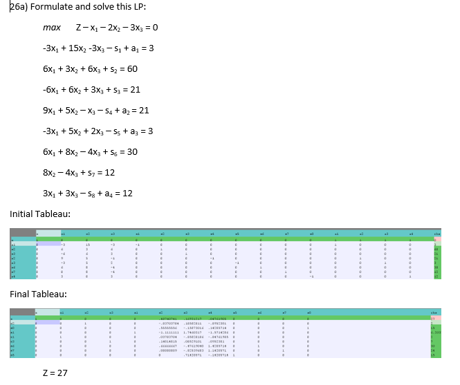

## Chapter 10: Transform and Conquer
### Exercise 26



## Chapter 11: Applications of Linear Programming
### Exercise 27
- Skipped this Problem

### Exercise 28


### Exercise 29


## Chapter 12: Branch and Bound
### Exercise 30


### Exercise 31
```java
import java.io.*;
import java.util.*;

public class Ex31 {

    private static Scanner input;
    private static int numOfItems;
    private static double weightCapacity;
    private static double highestProfit = 0;
    private static Node bestNode = null;
    private static Item[] items;
    private static ArrayList<Node> queue = new ArrayList<Node>();
    private static int nodeCount = 0;
    public static void main(String[] args) throws IOException{
        
        Scanner keys = new Scanner(System.in);
        print("Please type in file name: ");
        String filename = keys.nextLine();
        try {
            input = new Scanner(new BufferedReader(new FileReader(filename)));
        } catch (Exception e) {
            print( "Problem opening file named [" + filename + "]" );
            System.exit(1);
        }

        weightCapacity = input.nextInt();
        numOfItems = input.nextInt();
        items = new Item[numOfItems];

        println("");

        println("Capacity of knapsack is " + weightCapacity);
        for(int i = 0; i < numOfItems; i++){
            items[i] = new Item(input.nextInt(), input.nextInt(), i + 1);
        }
        printItems();
        println("");
        println("Begin exploration of possibilities tree:");
        double firstBound = findBound(items);

        Node head = new Node(++nodeCount, new Item[0], 0, 0, 0, firstBound, items);
        exploreNode(head);

        println("");
        println("Best Node: " + bestNode.toString());

    }
    private static void exploreNode(Node node){
        println("Exploring " + node.toString());

        if(node.bound < highestProfit){
            println("\tpruned, bound "+ node.bound +" is smaller than known profit " + highestProfit);
        }
        else{

            Node leftChild, rightChild;
            
            Item[] avLeft = remove(node.avItems, node.level);
            Item[] avRight = node.avItems;
            Item[] currLeft = node.currItems;
            Item[] currRight = add(node.currItems, node.level);
            
            double lbound = findBound(avLeft);
            double rbound = findBound(avRight);
            
            int newLevel = node.level + 1;
            
            leftChild = new Node(++nodeCount, currLeft, newLevel, node.profit, node.weight, lbound, avLeft);
            println("\tLeft child is " + leftChild.toString());
            if(newLevel < numOfItems){
                println("\t\texplore further");
                queue.add(leftChild);
            }
            else{
                println("no more nodes to explore");
            }
            
            double rweight = node.weight + items[node.level].weight;
            double rprofit = node.profit + items[node.level].profit;
            rightChild = new Node(++nodeCount, currRight, newLevel, rprofit, rweight, rbound, avRight);
            println("\tRight child is " + rightChild.toString());
            if(rweight > weightCapacity){
                println("\t\tpruned, too heavy");
            }
            else{
                if (rweight == weightCapacity){
                    println("\t\thit capacity so don't explore further");
                }
                else if(newLevel < numOfItems){
                    println("\t\texplore further");
                    queue.add(rightChild);
                    println("");
                }
                if(rprofit > highestProfit){
                    println("\t\tnote achievable profit of " + rprofit);
                    highestProfit = rprofit;
                    bestNode = rightChild;
                }
            }
        }
        println("");
        while(queue.size() > 0){
            exploreBestBound(queue);
        }

    }
    private static void exploreBestBound(ArrayList<Node> q){
        double bestBound = 0;
        int bestI = 0;

        for(int i = 0; i < q.size() ; i++){
            if(q.get(i).bound > bestBound){
                bestBound = q.get(i).bound;
                bestI = i;
            }
        }
        Node exp = q.remove(bestI);
        exploreNode(exp);
    }
    private static Item[] add(Item[] curr, int add){
        Item[] newCurr = new Item[curr.length + 1];
        for (int i = 0; i < curr.length; i++) 
            newCurr[i] = curr[i]; 
  
        newCurr[curr.length] = items[add]; 
  
        return newCurr; 

    }
    private static Item[] remove(Item[] av, int remove){
        Item[] newAv = new Item[av.length - 1];
        for (int i = 0, k = 0; i < av.length; i++) { 
            if (av[i].index - 1 == remove) { 
                continue; 
            } 
            newAv[k++] = av[i];
        }

        return newAv;
    }
    private static double findBound(Item[] available){

        double bound = 0;
        double weightLeft = weightCapacity;

        for(int i = 0; i < available.length; i++){
            double weight = available[i].weight;
            double profit = available[i].profit;
            if(weightLeft > 0){
                if( weightLeft - weight >= 0 ){
                    bound += profit;
                }
                else {
                    bound += (profit/weight) * weightLeft;
                }
                weightLeft -= weight;
            }
        }

        return bound;
    }
    private static void printItems(){
        println("Items are:");
        for(int i = 0; i < items.length ; i++){
            println(items[i].index + ": " + items[i].profit + " " + items[i].weight);
        }
    }
    private static void print(Object obj){
        System.out.print(obj.toString());
    }
    private static void println(Object obj){
        System.out.println(obj.toString());
    }
}

class Node{

    public Item[] currItems, avItems;
    public int id, level;
    public double bound, profit, weight;

    public Node(int id, Item[] currItems, int level, double profit, double weight, double bound, Item[] avItems){
        this.id = id;
        this.currItems = currItems;
        this.level = level;
        this.profit = profit;
        this.weight = weight;
        this.bound = bound;
        this.avItems = avItems;
    }
    public String toString(){
        String nodeString = "<Node " + id + ":   items: [";
        
        for(int i = 0; i < currItems.length; i++){
            if(i == 0) nodeString += currItems[i].index;
            else nodeString += ", " + currItems[i].index;
        }

        nodeString += "] level: " + level + " profit: " + profit + " weight: " + weight + " bound: " + bound + ">";

        return nodeString;
    }

}

class Item{

    public int index;
    public double profit, weight;
    public Item(double profit, double weight, int index){
        this.profit = profit;
        this.weight = weight;
        this.index = index;
    }
}
```

### Exercise 32


## Chapter 13: Designing Algorithms to Approximately Solve a Problem
### Exercise 33
- Skipped this problem
