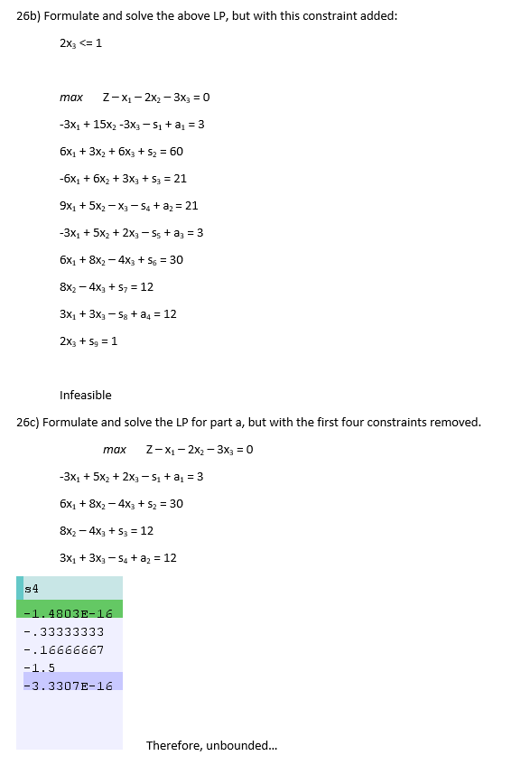

## Chapter 10: Transform and Conquer
### Exercise 26

## Chapter 11: Applications of Linear Programming
### Exercise 27
- Skipped this Problem

### Exercise 28

### Exercise 29

## Chapter 12: Branch and Bound
### Exercise 30

### Exercise 31

### Exercise 32

## Chapter 13: Designing Algorithms to Approximately Solve a Problem
### Exercise 33
- Skipped this problem
